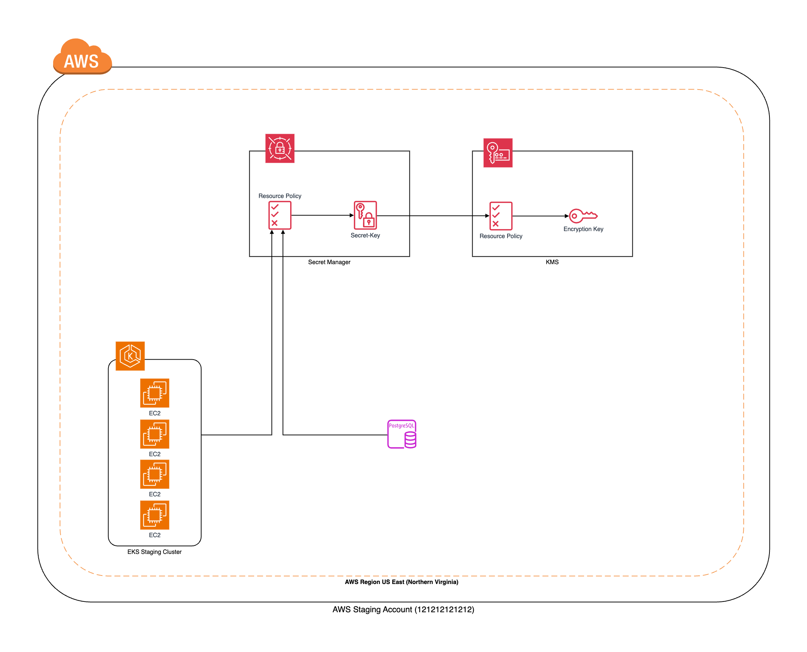
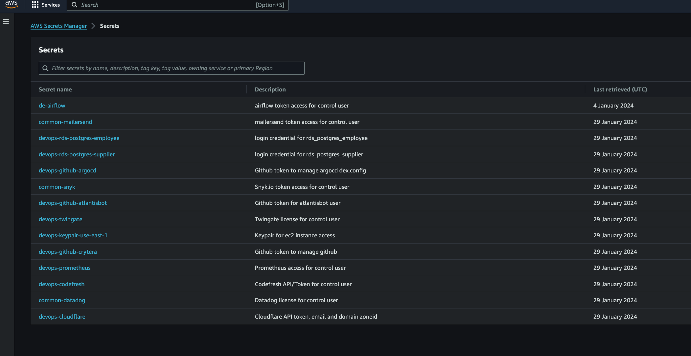

# AWS Secrets Manager

This reference architecture provides for deploying the following AWS services :
- Amazon SecretManager

## Prerequisites Notes
To enhance security, a custom Key Management Service (KMS) is established before creating Secret Manager. This ensures encryption of secrets stored within Secret Manager. The overarching principle is to maintain secrets in a centralized format, providing a clear reference for credential locations. Additionally, Secret Manager serves as a robust alternative to seal-secret for Kubernetes secret management.

### Environment
Secret Manager is structured based on pod teams, ensuring that each team has exclusive Read/Write access to their own secrets. This segregation is defined by incorporating team prefixes in the Secret Manager naming convention, exemplified as <$team-prefix>-<$application>. For shared secrets requiring Read access for everyone, the prefix is standardized as common-<$application>.

### Tested on the following Region:
 - US East (N. Virginia)



## Quickstart
Make sure awscli is configured using `aws configure`, or the `AWS_ACCESS_KEY_ID` and `AWS_SECRET_ACCESS_KEY` are properly exported into the environment.

Run Terraform Install Secret Manager:

```bash
terraform init
terraform plan -out=plan.tfplan
terraform apply "plan.tfplan"
```

Run Terraform Uninstall Secret manager:

```bash
terraform destroy -auto-approve
```

### Example Setup

```hcl
locals {
  prefix = "de" //Data Engineering
  kmsid  = data.terraform_remote_state.devops_staging_kms.outputs.kms_timeclone_dev.key_arn
  tags = {
    Pod         = "DE"
    Environment = "staging"
    Terraform   = "true"
  }

  prefix_common = "common" //Common - Allow Read Access to All users
  tags_common = {
    Pod         = "ALL"
    Environment = "staging"
    Terraform   = "true"
  }
}

module "secrets_manager_airflow" {
  source      = "../../../../modules/aws/secretmanager/v1_1_1"
  name        = "${local.prefix}-airflow"
  tags        = local.tags
  kms_key_id  = local.kmsid
  description = "airflow token access for control user"
}
```

### Configuration
Retrieve Secret Manager Option
```hcl
# Example Retrieve Credential from AWS Secret Manager
# Ref : https://registry.terraform.io/providers/hashicorp/aws/latest/docs/resources/secretsmanager_secret_version

# Get Secret
data "aws_secretsmanager_secret_version" "get_rds" {
  secret_id = data.terraform_remote_state.devops_staging_secretmanager.outputs.secrets_manager_rds_postgres_employee.id
}

locals {
  jdbc_username = jsondecode(data.aws_secretsmanager_secret_version.get_rds.secret_string)["JDBC_USERNAME"]
  jdbc_password = jsondecode(data.aws_secretsmanager_secret_version.get_rds.secret_string)["JDBC_PASSWORD"]
}
```



## Author

Thinegan Ratnam
 - [http://thinegan.com](http://thinegan.com/)

## Copyright and License

Copyright 2024 Thinegan Ratnam

Code released under the MIT License.