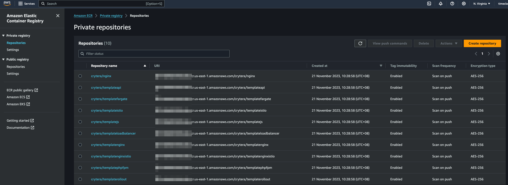
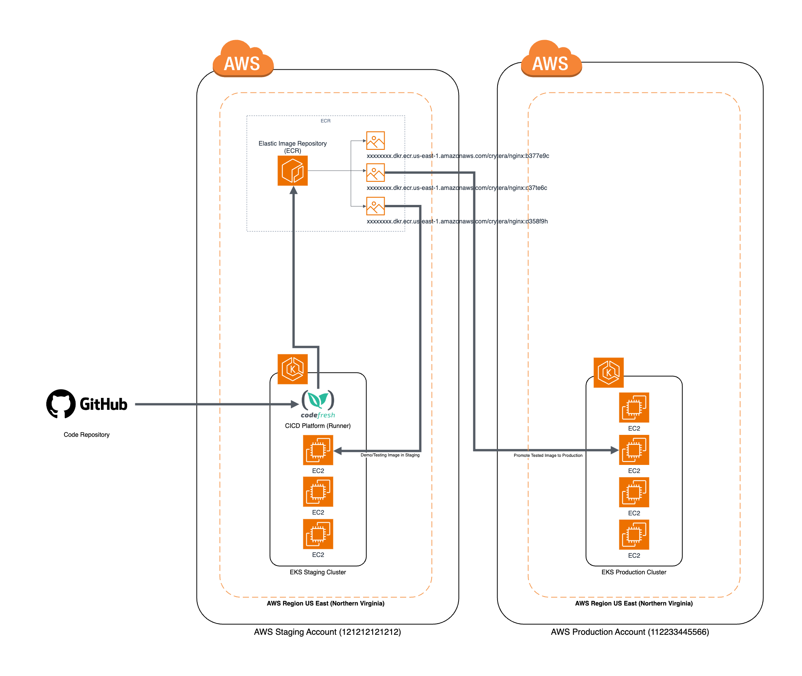

# Amazon Elastic Container Registry

This reference architecture provides for deploying the following AWS services :
- Amazon ECR

## Prerequisites Notes

Verify that your IAM user possesses the necessary permissions to build and push images to the ECR repository. Grant read-only access specifically to the AWS Production Account. Prioritize testing the image thoroughly in the staging/pre-production environment to ensure its integrity and performance before promoting it to the production account.

### Environment
- In the staging environment, a Docker image is crafted and tested within the staging/pre-production environment. Upon the successful completion of testing, the existing ECR image is ready to be seamlessly promoted to the production environment.

### Tested on the following Region:
 - US East (N. Virginia)



## Quickstart
Make sure awscli is configured using `aws configure`, or the `AWS_ACCESS_KEY_ID` and `AWS_SECRET_ACCESS_KEY` are properly exported into the environment.
Ensure this user has IAM access to access production AWS Account. (Production_CrossAccountAdminRole)
Ref: https://docs.aws.amazon.com/IAM/latest/UserGuide/access_policies-cross-account-resource-access.html

```bash
Example Running Multiple AWS Provider : 
// AWS Provider (profile - default)
provider "aws" {
  alias  = "staging"
  region = "us-east-1"
}

// AWS Provider (profile - production1)
provider "aws" {
  alias   = "production"
  region  = "us-east-1"
  profile = "production1"
}

// Setup aws staging environment
aws configure
AWS Access Key ID [****************]:
AWS Secret Access Key [****************]:
Default region name [us-east-1]:
Default output format [None]:

// Setup aws staging & production config
/> vim ~/.aws/config
[default]
region = us-east-1

[profile production1]
role_arn=arn:aws:iam::xxxxxxxxxxxx:role/CrossAccountAdmin
source_profile=default
role_session_name=session_prduction1
region=us-east-1
output=text
```

Run Terraform Install ECR:

```bash
terraform init
terraform plan -out=plan.tfplan
terraform apply "plan.tfplan"
```

Run Terraform Uninstall ECR:

```bash
terraform destroy -auto-approve
```

### Example Setup

```hcl
locals {
  repo_acc1 = "crytera"
}

################################################################################
# Create ECR image
# Example : xxxxxxx.dkr.ecr.us-east-1.amazonaws.com/crytera/xxxxxxxx
# Note : Removing a ecr repo will delete image created under this repo too
################################################################################
locals {
  ecr_repo = {
    "repo01" = { acc_name = "${local.repo_acc1}", repo_name = "templateistio" },
    "repo02" = { acc_name = "${local.repo_acc1}", repo_name = "templatenginxistio" },
    "repo03" = { acc_name = "${local.repo_acc1}", repo_name = "templatefargate" },
    ...
  }
}
```

### Configuration
Add ReadOnly access to production AWS account
```hcl

data "aws_caller_identity" "production" {
  provider = aws.production
}

allow_readonly = ["arn:aws:iam::${data.aws_caller_identity.production.account_id}:root"]
```
### Amazon ECR Cross-Account Access for Containerized Applications on EKS


## Author

Thinegan Ratnam
 - [http://thinegan.com](http://thinegan.com/)

## Copyright and License

Copyright 2024 Thinegan Ratnam

Code released under the MIT License.