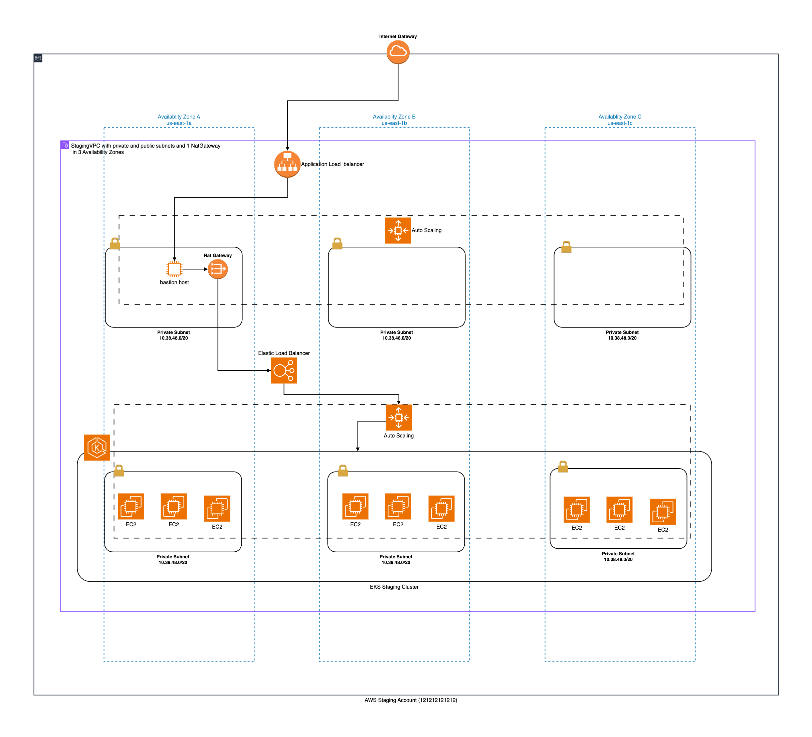

# Amazon EKS

This reference architecture provides for deploying the following AWS services :
- Amazon EKS

## Prerequisites Notes
To start EKS, you need VPC as a network layer and Secret Manager, KMS to pass credential.

### Environment
Example EKS(v1.28) using Managed Nodes option :

AWS EKS + Nginx Ingress + Node Group Instance(EC2) + Istio Service Mesh
source = "modules/aws/eks/staging/managed_nginx_nodes_istio/v1_28"

AWS EKS + Nginx Ingress + Node Group Instance(EC2)
source = "modules/aws/eks/staging/managed_nginx_nodes/v1_28"

AWS EKS + ALB Ingress + Node Group Instance(EC2) + Istio Service Mesh
source = "modules/aws/eks/staging/managed_alb_nodes_istio/v1_28"

AWS EKS + ALB Ingress + Node Group Instance(EC2) + Fargate(Serverless)
source = "modules/aws/eks/staging/managed_alb_nodes_fargate/v1_28"

AWS EKS + ALB Ingress + Node Group Instance(EC2)
source = "modules/aws/eks/staging/managed_alb_nodes/v1_28"

### Tested on the following Region:
 - US East (N. Virginia)



## Quickstart
Make sure awscli is configured using `aws configure`, or the `AWS_ACCESS_KEY_ID` and `AWS_SECRET_ACCESS_KEY` are properly exported into the environment.
Ensure this user has IAM access to access production AWS Account. (Production_CrossAccountAdminRole)
Ref: https://docs.aws.amazon.com/IAM/latest/UserGuide/access_policies-cross-account-resource-access.html

```bash
Example Running Multiple AWS Provider : 
// AWS Provider (profile - default)
provider "aws" {
  alias  = "staging"
  region = "us-east-1"
}

// AWS Provider (profile - production1)
provider "aws" {
  alias   = "production"
  region  = "us-east-1"
  profile = "production1"
}

// Setup aws staging environment
aws configure
AWS Access Key ID [****************]:
AWS Secret Access Key [****************]:
Default region name [us-east-1]:
Default output format [None]:

// Setup aws staging & production config
/> vim ~/.aws/config
[default]
region = us-east-1

[profile production1]
role_arn=arn:aws:iam::xxxxxxxxxxxx:role/CrossAccountAdmin
source_profile=default
role_session_name=session_prduction1
region=us-east-1
output=text
```

Run Terraform Install VPC:

```bash
terraform init
terraform plan -out=plan.tfplan
terraform apply "plan.tfplan"
```

Run Terraform Uninstall VPC:

```bash
terraform destroy -auto-approve
```

### Example Setup

```hcl
module "eks_staging_test6" {
  # Example EKS using Managed Nodes
  source = "modules/aws/eks/staging/managed_alb_nodes/v1_28"

  name        = "stag-eks-test6"
  pod         = "DEVOPS"
  environment = "staging"

  # Network
  vpcid              = data.terraform_remote_state.devops_staging_network.outputs.stagingVPC.id
  private_subnet_ids = data.terraform_remote_state.devops_staging_network.outputs.stagingVPC.private_subnets
  public_subnet_ids  = data.terraform_remote_state.devops_staging_network.outputs.stagingVPC.public_subnets

  # KMS
  kmsid = data.terraform_remote_state.devops_staging_kms.outputs.kms_timeclone_dev.key_arn

  # Secretmanager
  secretmanagerid = {
    codefresh     = data.terraform_remote_state.devops_staging_secretmanager.outputs.secrets_manager_codefresh.id
    github_argocd = data.terraform_remote_state.devops_staging_secretmanager.outputs.secrets_manager_github_argocd.id
    datadog       = data.terraform_remote_state.devops_staging_secretmanager.outputs.secrets_manager_datadog.id
    prometheus    = data.terraform_remote_state.devops_staging_secretmanager.outputs.secrets_manager_prometheus.id
    cloudflare    = data.terraform_remote_state.devops_staging_secretmanager.outputs.secrets_manager_cloudflare.id
  }

  # General Purpose Node Group
  gen1_node_group    = "pluto"
  gen1_instance_type = ["t3.large"]
  gen1_capacity_type = "SPOT" //SPOT or ON_DEMAND
  gen1_min_size      = 2
  gen1_max_size      = 6
  gen1_desired_size  = 2

}
```

## Author

Thinegan Ratnam
 - [http://thinegan.com](http://thinegan.com/)

## Copyright and License

Copyright 2024 Thinegan Ratnam

Code released under the MIT License.