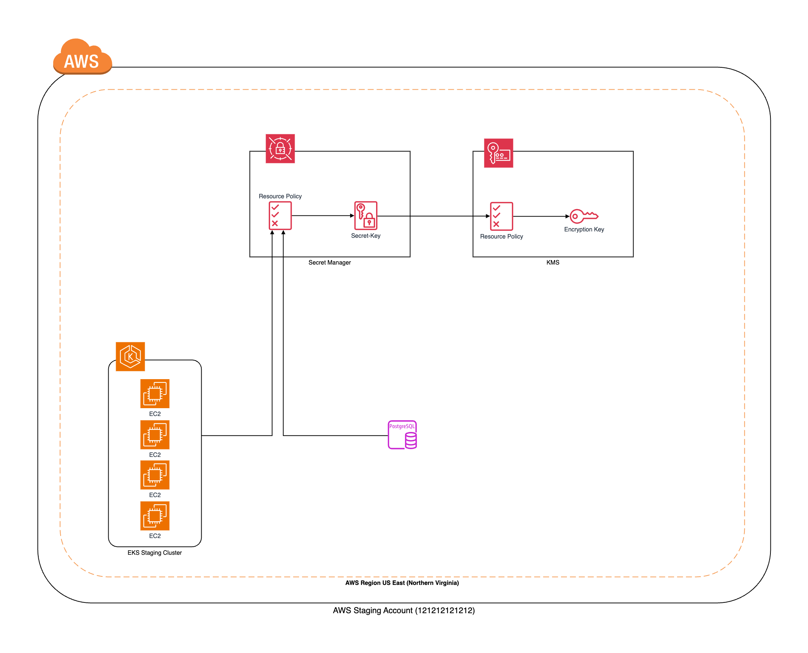
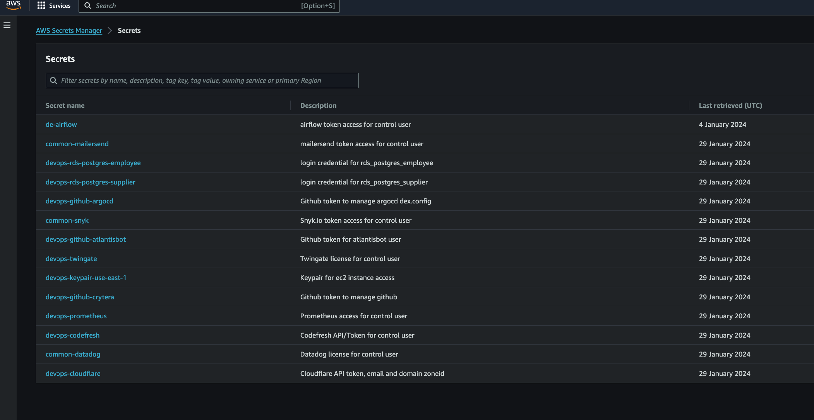

# AWS Key Management Service (KMS)
Management of cryptographic keys in a cryptosystem.
This reference architecture provides for deploying the following AWS services :
- Amazon KMS

## Prerequisites Notes
This code base will use Custom KMS to encrypted/decrypt in AWS Secret Manager, EKS Setup and etc...

### Tested on the following Region:
 - US East (N. Virginia)



## Quickstart
Make sure awscli is configured using `aws configure`, or the `AWS_ACCESS_KEY_ID` and `AWS_SECRET_ACCESS_KEY` are properly exported into the environment.

Run Terraform Install Secret Manager:

```bash
terraform init
terraform plan -out=plan.tfplan
terraform apply "plan.tfplan"
```

Run Terraform Uninstall Secret manager:

```bash
terraform destroy -auto-approve
```

### Example Setup

```hcl
locals {
  usr_owner = "thinegan"
  usr_admin = "terraformer"
  usr_user  = "EveBrown"
}

module "kms_timeclone_dev" {
  source  = "terraform-aws-modules/kms/aws"
  version = "2.1.0"

  description         = "External key example"
  key_usage           = "ENCRYPT_DECRYPT"
  enable_key_rotation = false

  # Policy
  key_owners = [
    "arn:aws:iam::${data.aws_caller_identity.current.account_id}:user/${local.usr_owner}"
  ]
  key_administrators = [
    "arn:aws:iam::${data.aws_caller_identity.current.account_id}:user/${local.usr_admin}"
  ]
  key_users = [
    "arn:aws:iam::${data.aws_caller_identity.current.account_id}:user/${local.usr_user}"
  ]
  key_service_roles_for_autoscaling = [
    # required for the ASG to manage encrypted volumes for eks nodes
    "arn:aws:iam::${data.aws_caller_identity.current.account_id}:role/aws-service-role/autoscaling.amazonaws.com/AWSServiceRoleForAutoScaling",
  ]

  # Aliases
  aliases                 = ["timeclone-dev/external"]
  aliases_use_name_prefix = true

  tags = {
    Terraform   = "true"
    Environment = "staging"
  }
}
```

### Configuration
Create Secret Manager using existing KMS Option
```hcl
locals {
  prefix = "devops" //DevOps
  kmsid  = data.terraform_remote_state.devops_staging_kms.outputs.kms_timeclone_dev.key_arn
  ...
  ..
}

# Create Secret - Cloudflare
module "secrets_manager_cloudflare" {
  source      = "../../../../modules/aws/secretmanager/v1_1_1"
  name        = "${local.prefix}-cloudflare"
  tags        = local.tags
  kms_key_id  = local.kmsid
  description = "Cloudflare API token, email and domain zoneid"
}
```



## Author

Thinegan Ratnam
 - [http://thinegan.com](http://thinegan.com/)

## Copyright and License

Copyright 2024 Thinegan Ratnam

Code released under the MIT License.