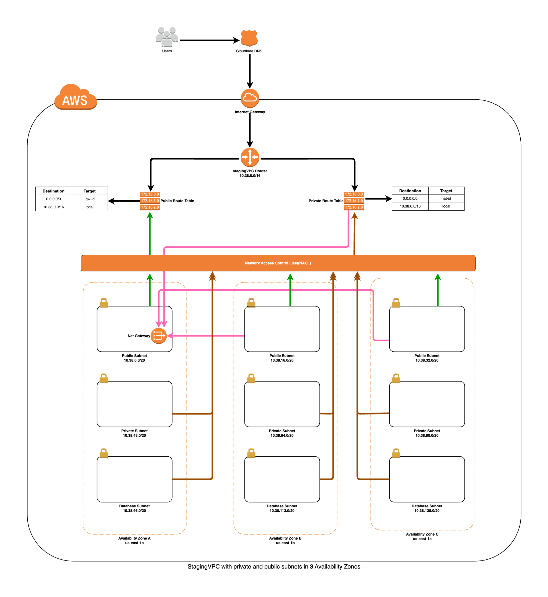

# VPC with DB, Private and Public subnets in 3 Availability Zones

This reference architecture provides for deploying the following AWS services :
- Amazon VPC
- Amazon NACL

## Prerequisites Notes

VPC peering connections cannot be established between VPCs with matching or overlapping IPv4 or IPv6 CIDR blocks. Even if you plan to utilize only non-overlapping CIDR blocks or solely IPv6 CIDR blocks, the presence of any overlapping IPv4 CIDR blocks will prevent the creation of a VPC peering connection. It is crucial to choose CIDR ranges that are uncommon to avoid potential overlaps. Exercise caution and refrain from using commonly used CIDR ranges, such as 192.168.* or 10.10.*.

### Environment
- Production Environment - For optimal high availability, the production environment deploys one NAT Gateway per availability zone, totaling approximately $105 per month across three availability zones. This strategy ensures robust connectivity and redundancy, albeit at a higher cost of around $35/month per NAT Gateway.

- NON-Production Environment (Staging/Development/QA) - In contrast, the non-production environment adopts a cost-effective approach by consolidating Internet traffic from all private subnets through a single NAT Gateway. This efficient utilization minimizes costs while maintaining adequate connectivity for staging, development, and QA activities.

### Refence IP Calculator
- ref : https://www.colocationamerica.com/ip-calculator
- Network Bits : */20
- Subnet Mask : 255.255.240.0
- Max Number of Subnets : 14
- Max Number of Hosts per subnet : 4094


## Tested on the following Region:
 - US East (N. Virginia)

This template describes a VPC with 3 private and 3 public subnets.



## Quickstart
Make sure awscli is configured using `aws configure`, or the `AWS_ACCESS_KEY_ID` and `AWS_SECRET_ACCESS_KEY` are properly exported into the environment.

Run Terraform Install VPC:

```bash
terraform init
terraform plan -out=plan.tfplan
terraform apply "plan.tfplan"
```

Run Terraform Uninstall VPC:

```bash
terraform destroy -auto-approve
```

### Example Setup

```hcl
module "stagingVPC" {
  source = "../../../../modules/aws/vpc/v5_1_2"

  name             = "stagingVPC"
  environment      = "staging"
  cidr             = "10.38.0.0/16"
  azs              = ["us-east-1a", "us-east-1b", "us-east-1c"]
  public_subnets   = ["10.38.0.0/20", "10.38.16.0/20", "10.38.32.0/20"]
  private_subnets  = ["10.38.48.0/20", "10.38.64.0/20", "10.38.80.0/20"]
  database_subnets = ["10.38.96.0/20", "10.38.112.0/20", "10.38.128.0/20"]
}
```

### Configuration
Add your service port at the VPC module section
```hcl
locals {
  # NACL Rules
  network_acls = {
    # Configure your custom ports
    public_inbound = [
      { #Datadog
        rule_number = 205
        rule_action = "allow"
        from_port   = 8126
        to_port     = 8126
        protocol    = "tcp"
        cidr_block  = "0.0.0.0/0"
      }
    ]
    public_outbound = [
      { #Datadog
        rule_number = 205
        rule_action = "allow"
        from_port   = 8126
        to_port     = 8126
        protocol    = "tcp"
        cidr_block  = "0.0.0.0/0"
      }
    ]
  }
}
```

## Author

Thinegan Ratnam
 - [http://thinegan.com](http://thinegan.com/)

## Copyright and License

Copyright 2024 Thinegan Ratnam

Code released under the MIT License.