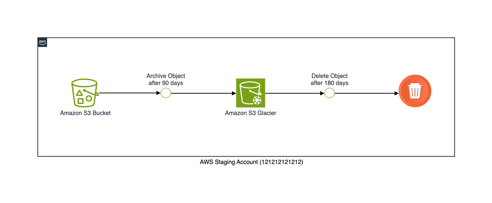

# AWS Simple Cloud Storage (S3)

This reference architecture provides for deploying the following AWS services :
- Amazon S3

## Prerequisites Notes
The S3 bucket will be created with default encryption using AES256, and its ownership will be set to "BucketOwnerEnforced". File objects older than 90 days will be archived to Glacier and subsequently deleted after 180 days.

Under the "BucketOwnerEnforced" setting, the bucket owner automatically assumes full control and ownership of every object within the bucket, rendering ACLs irrelevant for permissions management within the S3 bucket.

### Tested on the following Region:
 - US East (N. Virginia)




## Quickstart
Make sure awscli is configured using `aws configure`, or the `AWS_ACCESS_KEY_ID` and `AWS_SECRET_ACCESS_KEY` are properly exported into the environment.

Run Terraform Install Secret Manager:

```bash
terraform init
terraform plan -out=plan.tfplan
terraform apply "plan.tfplan"
```

Run Terraform Uninstall Secret manager:

```bash
terraform destroy -auto-approve
```

### Example Setup

```hcl
# Create example S3 from Modules
module "s3_github_terraform" {
  source = "../../../../modules/aws/s3/v3_15_1"

  name        = "github-crytera-terraform-tfstate"
  pod         = "DEVOPS"
  environment = "staging"
}
```

## Author

Thinegan Ratnam
 - [http://thinegan.com](http://thinegan.com/)

## Copyright and License

Copyright 2024 Thinegan Ratnam

Code released under the MIT License.