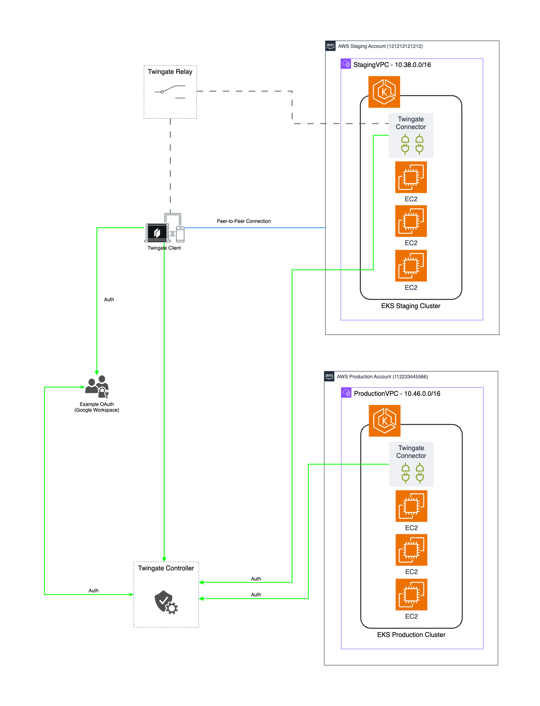

# Twingate (VPN Alternative)
Twingate is a central Zero Trust orchestration layer, that provides a secure remote access solution for an organization's private applications, data, and environments.

## Prerequisites Notes
As a 3rd Party Monitoring tool, subscription to this service is required. The basic plan is free and available for testing purposes.

Twingate example installation via helm : https://artifacthub.io/packages/helm/connector/connector

This installation example will require a running EKS Cluster.
For redundancy, always deploy a minimum of two Connectors per Remote Network

### Tested on the following Region:
 - US East (N. Virginia)



## Quickstart
Make sure awscli is configured using `aws configure`, or the `AWS_ACCESS_KEY_ID` and `AWS_SECRET_ACCESS_KEY` are properly exported into the environment.
Ensure this user has IAM access to access production AWS Account. (Production_CrossAccountAdminRole)

Ref: https://docs.aws.amazon.com/IAM/latest/UserGuide/access_policies-cross-account-resource-access.html

```bash
Example Running Multiple AWS Provider : 
// AWS Provider (profile - default)
provider "aws" {
  alias  = "staging"
  region = "us-east-1"
}

// AWS Provider (profile - production1)
provider "aws" {
  alias   = "production"
  region  = "us-east-1"
  profile = "production1"
}

// Setup aws staging environment
aws configure
AWS Access Key ID [****************]:
AWS Secret Access Key [****************]:
Default region name [us-east-1]:
Default output format [None]:

// Setup aws staging & production config
/> vim ~/.aws/config
[default]
region = us-east-1

[profile production1]
role_arn=arn:aws:iam::xxxxxxxxxxxx:role/CrossAccountAdmin
source_profile=default
role_session_name=session_prduction1
region=us-east-1
output=text
```

Run Terraform Install:

```bash
terraform init
terraform plan -out=plan.tfplan
terraform apply "plan.tfplan"
```

Run Terraform Uninstall:

```bash
terraform destroy -auto-approve
```

### Example Setup

```hcl
resource "helm_release" "twingate" {
  name             = "twingate-pastel-coati"
  namespace        = "vpn"
  create_namespace = true
  chart            = "connector"
  repository       = "https://twingate.github.io/helm-charts"
  version          = "0.1.23"

  set {
    name  = "connector.network"
    value = jsondecode(data.aws_secretsmanager_secret_version.get_twingate.secret_string)["twingate1.network"]
  }

  set {
    name  = "connector.accessToken"
    value = jsondecode(data.aws_secretsmanager_secret_version.get_twingate.secret_string)["twingate1.accessToken"]
  }

  set {
    name  = "connector.refreshToken"
    value = jsondecode(data.aws_secretsmanager_secret_version.get_twingate.secret_string)["twingate1.refreshToken"]
  }
}
```

## Author

Thinegan Ratnam
 - [http://thinegan.com](http://thinegan.com/)

## Copyright and License

Copyright 2024 Thinegan Ratnam

Code released under the MIT License.